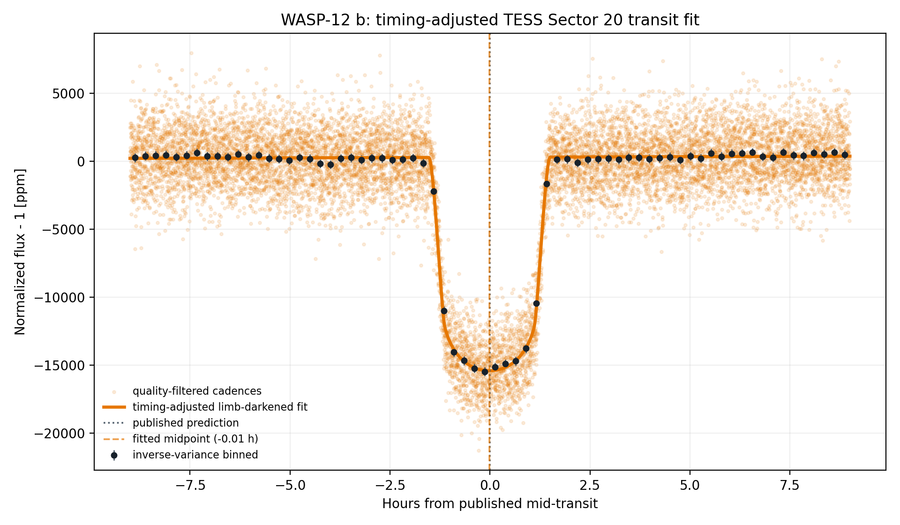
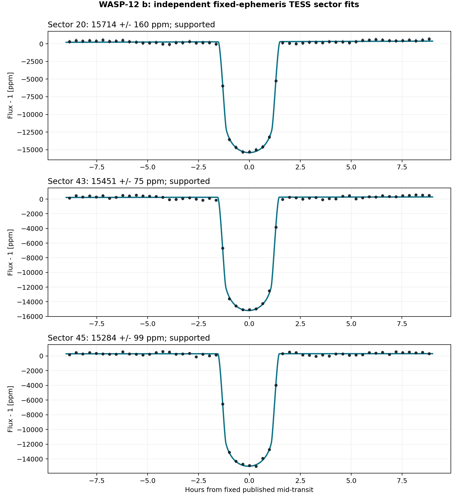
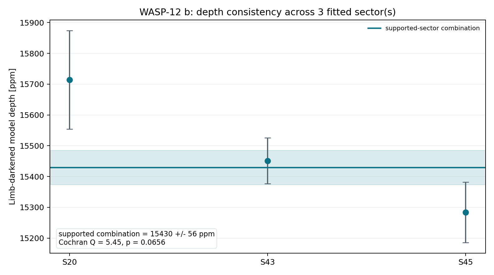
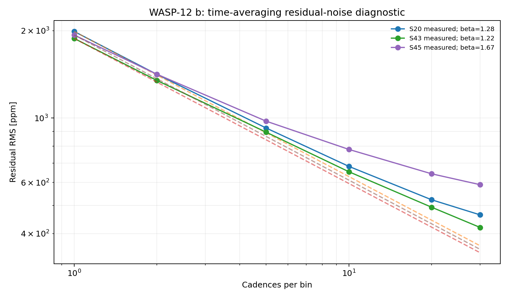
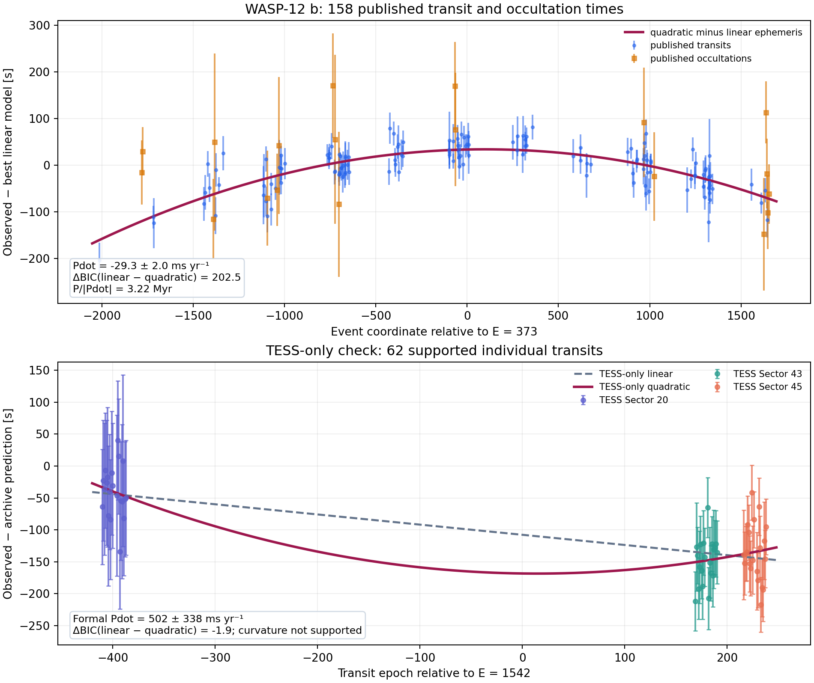

# WASP-12 b: A Doomed Hot Jupiter with a Decaying Orbit
<!-- RESEARCH-IDENTITY-START -->
**Independent research report by [Biswajit Jana](https://biswajit1999.github.io/Biswajit_Jana.github.io/)** · [Live report](https://biswajit1999.github.io/wasp-12b-exoplanet-report/) · [ORCID](https://orcid.org/0009-0002-2411-1891) · [Complete research portfolio](https://biswajit1999.github.io/Biswajit_Jana.github.io/research/exoplanets/)
<!-- RESEARCH-IDENTITY-END -->


<!-- TARGET-IDENTITY-START -->
<p align="center">
  
</p>

<p align="center"><em>AI-generated artist's interpretation informed by the measured system properties; not a direct image.</em></p>

**Hot Jupiter · orbital decay · extreme irradiation**

A severely irradiated giant spiralling toward its star, framed as a careful TESS timing analysis where ephemeris drift is itself part of the science.
<!-- TARGET-IDENTITY-END -->
<p align="center">
  
</p>


**[Open the full report](https://biswajit1999.github.io/wasp-12b-exoplanet-report/)** — the live GitHub Pages version.

## Data sources

- **System parameters** — the saved `pscomppars` row from the [NASA Exoplanet Archive TAP service](https://exoplanetarchive.ipac.caltech.edu/TAP/sync?query=select+pl_name%2Chostname%2Cra%2Cdec%2Cpl_orbper%2Cpl_tranmid%2Cpl_trandur%2Cpl_rade%2Cpl_bmasse%2Cpl_eqt%2Cpl_orbsmax%2Csy_dist%2Csy_tmag%2Cst_teff%2Cst_rad%2Cst_mass%2Cdisc_year%2Cdiscoverymethod%2Cdisc_refname%2Cdisc_pubdate%2Cdisc_facility+from+pscomppars+where+pl_name%3D%27WASP-12+b%27&format=csv).
- **Observed photometry** — unmodified MAST file `tess2019357164649-s0020-0000000086396382-0165-s_lc.fits`, TESS Sector 20, DOI [10.17909/t9-nmc8-f686](https://doi.org/10.17909/t9-nmc8-f686). This is a real SPOC reduced light curve, not simulated data.
- Exact URLs, IDs, retrieval date, and SHA-256 checksum are in [`data/SOURCE.md`](data/SOURCE.md).

## Reproduce the analysis

```bash
pip install -r requirements.txt
python scripts/analyze_transit.py
python scripts/analyze_multisector.py
python scripts/analyze_orbital_decay.py
pytest tests/ -v
```

The script keeps finite `QUALITY == 0` cadences, normalizes `PDCSAP_FLUX`, and applies one symmetric robust outlier rule. A local linear null is compared with a circular quadratic-limb-darkened transit. The archive period and predicted phase are retained, while midpoint, radius ratio, impact parameter, baseline, and baseline slope are fitted inside a bounded window. The limb-darkening coefficients and scaled semi-major axis are fixed and disclosed in the CSV.

## What the corrected fit shows

| Quantity | Result |
|---|---:|
| TESS sector | 20 |
| Cadences in fitted window | 11385 |
| Transit support | ΔBIC ≥ 10 |
| Midpoint correction | -0.011 h ± 0.33 min |
| Model mid-transit depth | 15714.4 ± 125.2 ppm |
| Radius ratio Rp/Rs | 0.11838 |
| Fitted / published duration | 3.016 / 3.001 h |
| Linear null χ² / dof / BIC | 19856.94 / 11383 / 19875.62 |
| Transit χ² / dof / BIC | 2692.96 / 11380 / 2739.66 |
| ΔBIC (null − transit) | 17135.95 |

The timing-adjusted transit is strongly preferred by ΔBIC = 17136.0. Its fitted midpoint is -0.011 hours from the historical prediction; the model's mid-transit depth is 15714.4 ± 125.2 ppm. A fitted timing correction can diagnose ephemeris drift, but this single-sector fit is not a replacement for a global transit-timing analysis.

<!-- MULTISECTOR-UPGRADE-START -->
## Multi-sector robustness and correlated noise

The archive prediction was timing-adjusted independently in 3 fitted sector(s) (S20, S43, S45), of which 3 meet Delta BIC >= 10. Formal depth errors were inflated by sqrt(max(reduced chi-square, 1)) times the residual time-averaging beta factor (observed range 1.22-1.67). The robust inverse-variance model depth across supported sectors is 15429.6 +/- 55.8 ppm; Cochran Q = 5.45 for 2 dof (p = 0.0656). These scaled errors address underestimated scatter and short-timescale correlation, but they are not a full Gaussian-process or physical limb-darkened transit fit.

<p align="center"></p>

<p align="center"></p>

<p align="center"></p>

The per-sector table is in [`figures/multisector_statistics.csv`](figures/multisector_statistics.csv). Regenerate all three figures with `python scripts/analyze_multisector.py`.
<!-- MULTISECTOR-UPGRADE-END -->

## Orbital decay: what the long baseline adds

<p align="center"></p>

The timing analysis deliberately separates two questions:

- **Can the three committed TESS sectors establish curvature by themselves?** No. Although 62 individual transits pass the per-event ΔBIC ≥ 10 support gate, a quadratic ephemeris is not preferred over a linear model (ΔBIC<sub>linear−quadratic</sub> = −1.9). The TESS-only formal curvature is positive and poorly constrained, so it is not interpreted as orbital decay.
- **Does the published long-baseline timing set favour decay?** Yes. A weighted fit to 158 published transit and occultation times gives **Ṗ = −29.28 ± 2.03 ms yr⁻¹** and strongly favours a quadratic ephemeris (**ΔBIC = 202.5**). The corresponding formal timescale is **P/|Ṗ| = 3.22 Myr**. Under the stated equilibrium-tide convention and saved system parameters, the derived modified stellar tidal quality factor is **Q′★ ≈ 2.07 × 10⁵**.

The repository result agrees with, but is independently recalculated from, the published timing compilation. Yee et al. (2020) reported −29 ± 2 ms yr⁻¹, and the later TESS-inclusive analysis by Wong et al. (2022) reported −29.81 ± 0.94 ms yr⁻¹. Agreement is a reproduction check, not a claim that this repository discovered the decay.

The committed event table is [`data/published_transit_occultation_times.csv`](data/published_transit_occultation_times.csv). Individual TESS measurements are in [`figures/individual_transit_timings.csv`](figures/individual_transit_timings.csv), while the model comparison and derived quantities are in [`figures/orbital_decay_statistics.csv`](figures/orbital_decay_statistics.csv).

## System context

- Radius: 22.03 Earth radii
- Mass: 467.21 Earth masses
- Orbital period: 1.091419 days
- Transit duration: 3.001 hours
- Semi-major axis: 0.0234 AU
- Equilibrium temperature: 2601 K
- Host: WASP-12 · distance 427.25 pc
- Discovery: 2008 by Transit (SuperWASP)

## Limitations

- The orbit is assumed circular and the quadratic limb-darkening coefficients are fixed representative values; they are not atmosphere-grid interpolations.
- The scaled semi-major axis is derived from the saved composite semi-major axis and stellar radius; their uncertainties are not propagated.
- Midpoint freedom corrects accumulated ephemeris error but introduces a bounded timing search. ΔBIC, not a naïve one-parameter p-value, is used as the support gate.
- PDCSAP processing, dilution, stellar variability, transit-timing variations, and long-timescale covariance can still bias the inferred geometry.
- Radius ratio, impact parameter, and fixed limb darkening are correlated. Published global fits with physical priors and simultaneous detrending remain authoritative.
- Individual TESS timings fix the sector-level transit shape and are correlated through common detrending and stellar variability; their TESS-only curvature is therefore shown as a failed sensitivity check, not a decay measurement.
- The long-baseline fit uses a separate constant offset for occultations to absorb light-travel time and any small `e cos(ω)` contribution, but it does not reproduce a full apsidal-precession model or re-reduce every historical light curve.

## Repository structure

```text
README.md
index.html
requirements.txt
data/                       TESS FITS + NASA row + published timing table + SOURCE.md
scripts/analyze_transit.py  timing-adjusted limb-darkened transit fit
scripts/analyze_orbital_decay.py  individual timings + ephemeris comparison
figures/                    generated plot + summary_statistics.csv
tests/                      real-data regression tests
.github/workflows/tests.yml CI on every push and pull request
LICENSE                     MIT
```

## References

1. [Hebb et al. 2009](https://ui.adsabs.harvard.edu/abs/2009ApJ...693.1920H/abstract) — discovery reference as listed by the NASA Exoplanet Archive.
2. Ricker, G. R. et al. (2015), *Transiting Exoplanet Survey Satellite (TESS)*, JATIS 1, 014003, [doi:10.1117/1.JATIS.1.1.014003](https://doi.org/10.1117/1.JATIS.1.1.014003).
3. TESS Team, *TESS Light Curves — All Sectors*, MAST, [doi:10.17909/t9-nmc8-f686](https://doi.org/10.17909/t9-nmc8-f686); Sector 20 used here.
4. [NASA Exoplanet Archive](https://exoplanetarchive.ipac.caltech.edu/), `pscomppars` TAP row retrieved 2026-08-15.
5. Yee, S. W. et al. (2020), *The Orbit of WASP-12b Is Decaying*, [doi:10.3847/2041-8213/ab5c16](https://doi.org/10.3847/2041-8213/ab5c16); machine-readable timing compilation mirrored by the [Susie example dataset](https://github.com/BoiseStatePlanetary/susie/blob/main/example_data/wasp12b_tra_occ.csv).
6. Wong, I. et al. (2022), *TESS Revisits WASP-12: Updated Orbital Decay Rate and Constraints on Atmospheric Variability*, [doi:10.3847/1538-3881/ac5680](https://doi.org/10.3847/1538-3881/ac5680).

## Author

Biswajit Jana — [Portfolio](https://biswajit1999.github.io/Biswajit_Jana.github.io/) · [GitHub](https://github.com/Biswajit1999) · [LinkedIn](https://www.linkedin.com/in/biswajit-jana-27011a151/) · [ORCID](https://orcid.org/0009-0002-2411-1891)
