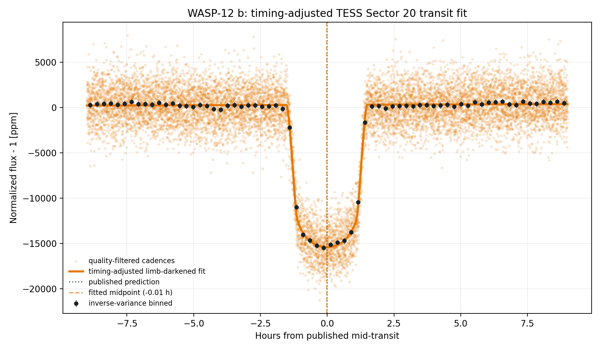
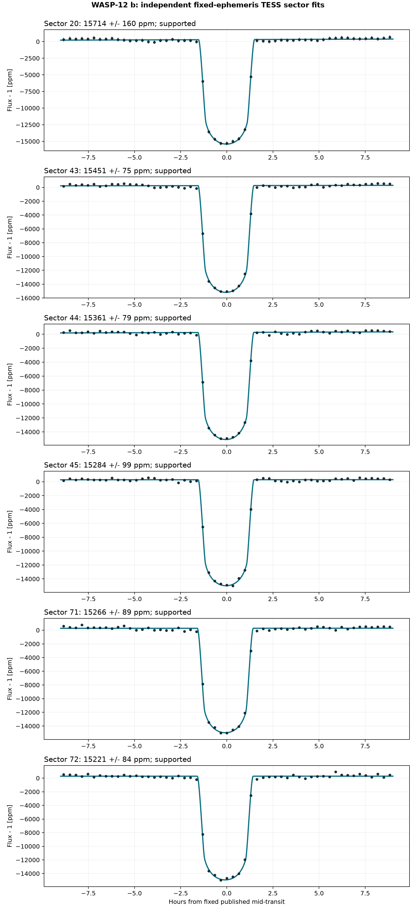
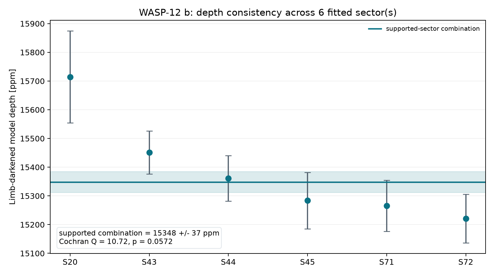
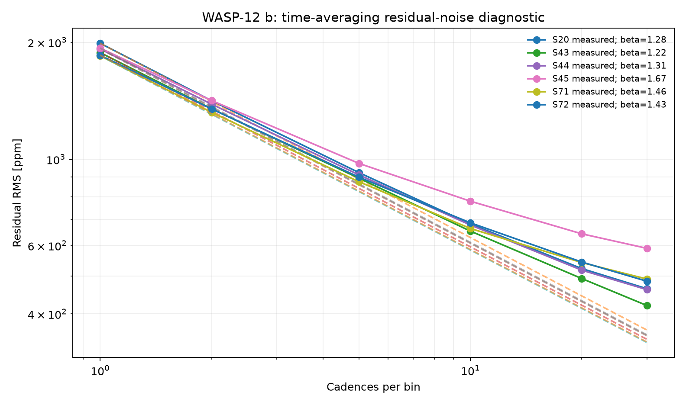
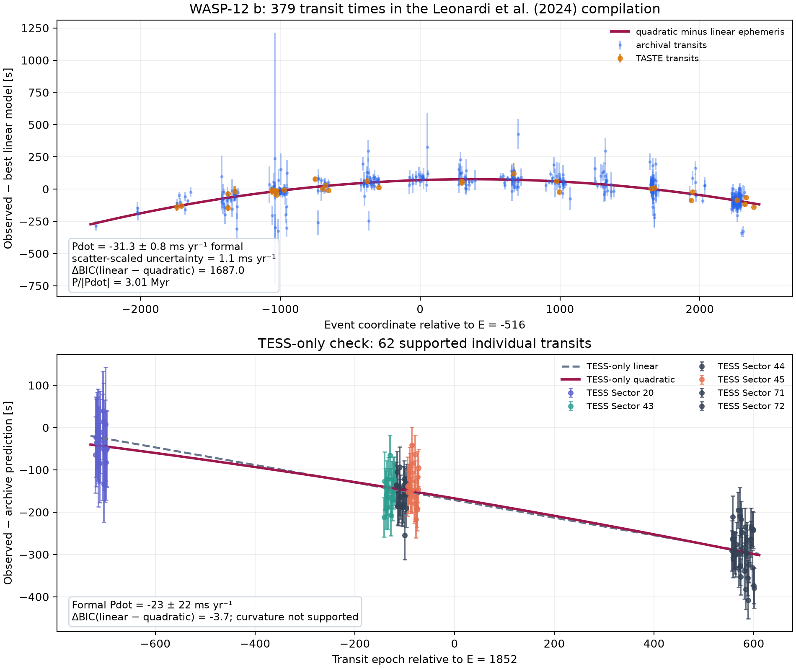
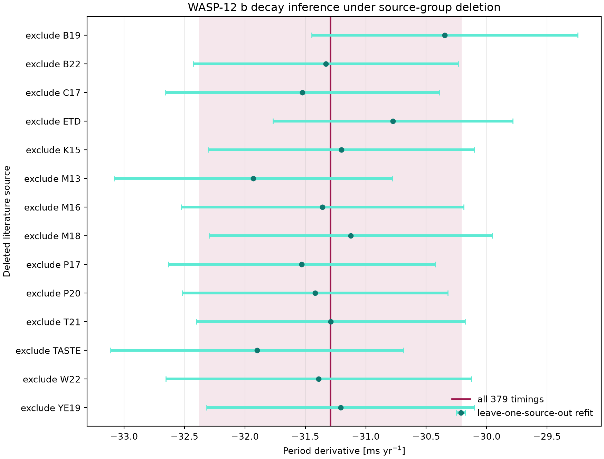

# WASP-12 b: Reproducing a Decaying Orbit
<!-- RESEARCH-IDENTITY-START -->
**Independent research report by [Biswajit Jana](https://biswajit1999.github.io/Biswajit_Jana.github.io/)** · [Live report](https://biswajit1999.github.io/wasp-12b-exoplanet-report/) · [ORCID](https://orcid.org/0009-0002-2411-1891) · [Complete research portfolio](https://biswajit1999.github.io/Biswajit_Jana.github.io/research/exoplanets/)
<!-- RESEARCH-IDENTITY-END -->


<!-- TARGET-IDENTITY-START -->
**Hot Jupiter · orbital decay · extreme irradiation**

A severely irradiated giant spiralling toward its star, framed as a careful TESS timing analysis where ephemeris drift is itself part of the science.
<!-- TARGET-IDENTITY-END -->
<p align="center">
  
</p>


**[Open the full report](https://biswajit1999.github.io/wasp-12b-exoplanet-report/)** — the live GitHub Pages version.

## Data sources

- **System parameters** — the saved `pscomppars` row from the [NASA Exoplanet Archive TAP service](https://exoplanetarchive.ipac.caltech.edu/TAP/sync?query=select+pl_name%2Chostname%2Cra%2Cdec%2Cpl_orbper%2Cpl_tranmid%2Cpl_trandur%2Cpl_rade%2Cpl_bmasse%2Cpl_eqt%2Cpl_orbsmax%2Csy_dist%2Csy_tmag%2Cst_teff%2Cst_rad%2Cst_mass%2Cdisc_year%2Cdiscoverymethod%2Cdisc_refname%2Cdisc_pubdate%2Cdisc_facility+from+pscomppars+where+pl_name%3D%27WASP-12+b%27&format=csv).
- **Observed photometry** — six unmodified 120-second TESS SPOC light curves from Sectors 20, 43, 44, 45, 71 and 72, DOI [10.17909/t9-nmc8-f686](https://doi.org/10.17909/t9-nmc8-f686). Full-frame and mixed-cadence products are deliberately excluded.
- **Expanded timing evidence** — the verbatim 379-row Leonardi et al. (2024) VizieR table [`J/A+A/686/A84/t0-lit`](https://cdsarc.cds.unistra.fr/viz-bin/cat/J/A+A/686/A84), plus the 158-row Yee et al. (2020) transit-and-occultation compilation for the apsidal-precession diagnostic.
- Exact URLs, IDs, retrieval date, and SHA-256 checksum are in [`data/SOURCE.md`](data/SOURCE.md).

## Reproduce the analysis

```bash
pip install -r requirements.txt
python scripts/analyze_transit.py
python scripts/analyze_multisector.py
python scripts/analyze_orbital_decay.py
pytest tests/ -v
```

The script keeps finite `QUALITY == 0` cadences, normalizes `PDCSAP_FLUX`, and applies one symmetric robust outlier rule. A local linear null is compared with a circular quadratic-limb-darkened transit. The archive period and predicted phase are retained, while midpoint, radius ratio, impact parameter, baseline, and baseline slope are fitted inside a bounded window. The limb-darkening coefficients and scaled semi-major axis are fixed and disclosed in the CSV.

## What the corrected fit shows

| Quantity | Result |
|---|---:|
| TESS sector | 20 |
| Cadences in fitted window | 11385 |
| Transit support | ΔBIC ≥ 10 |
| Midpoint correction | -0.011 h ± 0.33 min |
| Model mid-transit depth | 15714.4 ± 125.2 ppm |
| Radius ratio Rp/Rs | 0.11838 |
| Fitted / published duration | 3.016 / 3.001 h |
| Linear null χ² / dof / BIC | 19856.94 / 11383 / 19875.62 |
| Transit χ² / dof / BIC | 2692.96 / 11380 / 2739.66 |
| ΔBIC (null − transit) | 17135.95 |

The timing-adjusted transit is strongly preferred by ΔBIC = 17136.0. Its fitted midpoint is -0.011 hours from the historical prediction; the model's mid-transit depth is 15714.4 ± 125.2 ppm. A fitted timing correction can diagnose ephemeris drift, but this single-sector fit is not a replacement for a global transit-timing analysis.

<!-- MULTISECTOR-UPGRADE-START -->
## Multi-sector robustness and correlated noise

The archive prediction was timing-adjusted independently in six sectors, all of which meet ΔBIC ≥ 10. Formal depth errors were inflated by sqrt(max(reduced chi-square, 1)) times the residual time-averaging beta factor (range 1.22–1.67). The inverse-variance model depth is 15348.3 ± 36.6 ppm; Cochran Q = 10.72 for 5 degrees of freedom (p = 0.057). The marginal cross-sector tension is worth monitoring and is not evidence for atmospheric variability: this is neither a Gaussian-process fit nor a simultaneous activity/instrument model.

<p align="center"></p>

<p align="center"></p>

<p align="center"></p>

The per-sector table is in [`figures/multisector_statistics.csv`](figures/multisector_statistics.csv). Regenerate all three figures with `python scripts/analyze_multisector.py`.
<!-- MULTISECTOR-UPGRADE-END -->

## Orbital decay: what the long baseline adds

<p align="center"></p>

The timing analysis deliberately separates three questions:

- **Can the six committed TESS sectors establish curvature by themselves?** No. Although 119 individual transits pass the per-event ΔBIC ≥ 10 support gate, a quadratic ephemeris is not preferred (ΔBIC<sub>linear−quadratic</sub> = −3.68). The conditional TESS-only value, −22.6 ± 21.5 ms yr⁻¹, is a failed sensitivity test rather than the decay measurement.
- **Does the expanded long-baseline transit compilation favour curvature?** Yes. A weighted refit of all 379 Leonardi et al. (2024) timings gives **Ṗ = −31.29 ± 0.76 ms yr⁻¹ formal**, with **ΔBIC = 1687.0**. Because χ²/dof = 2.04, the headline uncertainty is conservatively scaled to **±1.09 ms yr⁻¹**. The implied formal timescale is **P/|Ṗ| = 3.01 Myr**, and Q′★ ≈ **1.94 × 10⁵** under the stated equilibrium-tide convention.
- **Can a precession-like timing model explain the older transit-and-occultation set as well as decay?** In a disclosed 5–100 year search, an opposing-sign sinusoidal timing proxy is disfavoured relative to the quadratic decay model by **ΔBIC = 20.16**. Its optimum lies near the upper search boundary, so its fitted period and amplitude are not physically interpreted. This diagnostic closely reproduces the direction and scale of Yee et al.'s published ΔBIC = 22.3, but it is not a replacement for their full physical model and posterior.

Deleting each literature source represented by at least five rows leaves Ṗ between **−31.93 and −30.35 ms yr⁻¹**; every deletion retains ΔBIC > 1293 in favour of the quadratic model. The result is therefore not created by any single major source group, although the excess scatter and shared reductions still preclude treating every row as perfectly independent.

<p align="center"></p>

The result is an independent reproduction of published evidence, not a discovery claim. Leonardi et al. (2024) reported −31.27 ± 1.23 ms yr⁻¹ for their 379-row combined sample; Akinsanmi et al. (2024) found −30.23 ± 0.82 ms yr⁻¹ from CHEOPS, TESS and Spitzer, while Yee et al. (2020) established that decay outperformed apsidal precession and a Rømer-delay explanation.

Machine-readable outputs are [`figures/individual_transit_timings.csv`](figures/individual_transit_timings.csv), [`figures/orbital_decay_statistics.csv`](figures/orbital_decay_statistics.csv), and [`figures/timing_source_sensitivity.csv`](figures/timing_source_sensitivity.csv).

## System context

- Radius: 22.03 Earth radii
- Mass: 467.21 Earth masses
- Orbital period: 1.091419 days
- Transit duration: 3.001 hours
- Semi-major axis: 0.0234 AU
- Equilibrium temperature: 2601 K
- Host: WASP-12 · distance 427.25 pc
- Discovery: 2008 by Transit (SuperWASP)

## Limitations

- The orbit is assumed circular and the quadratic limb-darkening coefficients are fixed representative values; they are not atmosphere-grid interpolations.
- The scaled semi-major axis is derived from the saved composite semi-major axis and stellar radius; their uncertainties are not propagated.
- Midpoint freedom corrects accumulated ephemeris error but introduces a bounded timing search. ΔBIC, not a naïve one-parameter p-value, is used as the support gate.
- PDCSAP processing, dilution, stellar variability, transit-timing variations, and long-timescale covariance can still bias the inferred geometry.
- Radius ratio, impact parameter, and fixed limb darkening are correlated. Published global fits with physical priors and simultaneous detrending remain authoritative.
- Individual TESS timings fix the sector-level transit shape and share detrending and stellar-variability systematics; their TESS-only curvature is therefore shown as a failed sensitivity check, not a decay measurement.
- The 379-row timing fit uses quoted diagonal errors. Scaling by sqrt(reduced χ²) acknowledges excess scatter but does not reconstruct covariance among timings derived by the same source.
- The opposing-sign sinusoid is a bounded apsidal timing proxy. Its boundary optimum is not an eccentricity or precession-period measurement, and the code does not reproduce the full Yee et al. physical posterior.
- Q′★ is convention- and parameter-dependent. It should be compared only with values calculated under compatible tidal definitions and stellar parameters.

## Repository structure

```text
README.md
index.html
requirements.txt
data/                       six TESS FITS + NASA row + two timing compilations + SOURCE.md
scripts/analyze_transit.py  timing-adjusted limb-darkened transit fit
scripts/analyze_orbital_decay.py  individual timings + ephemeris comparison
figures/                    generated figures + machine-readable analysis tables
tests/                      real-data regression tests
.github/workflows/tests.yml CI on every push and pull request
LICENSE                     MIT
```

## References

1. [Hebb et al. 2009](https://ui.adsabs.harvard.edu/abs/2009ApJ...693.1920H/abstract) — discovery reference as listed by the NASA Exoplanet Archive.
2. Ricker, G. R. et al. (2015), *Transiting Exoplanet Survey Satellite (TESS)*, JATIS 1, 014003, [doi:10.1117/1.JATIS.1.1.014003](https://doi.org/10.1117/1.JATIS.1.1.014003).
3. TESS Team, *TESS Light Curves — All Sectors*, MAST, [doi:10.17909/t9-nmc8-f686](https://doi.org/10.17909/t9-nmc8-f686); Sectors 20, 43, 44, 45, 71 and 72 used here.
4. [NASA Exoplanet Archive](https://exoplanetarchive.ipac.caltech.edu/), `pscomppars` TAP row retrieved 2026-08-15.
5. Yee, S. W. et al. (2020), *The Orbit of WASP-12b Is Decaying*, [doi:10.3847/2041-8213/ab5c16](https://doi.org/10.3847/2041-8213/ab5c16); machine-readable timing compilation mirrored by the [Susie example dataset](https://github.com/BoiseStatePlanetary/susie/blob/main/example_data/wasp12b_tra_occ.csv).
6. Wong, I. et al. (2022), *TESS Revisits WASP-12: Updated Orbital Decay Rate and Constraints on Atmospheric Variability*, [doi:10.3847/1538-3881/ac5680](https://doi.org/10.3847/1538-3881/ac5680).
7. Leonardi, P. et al. (2024), *TASTE V. A new ground-based investigation of orbital decay in the ultra-hot Jupiter WASP-12b*, [doi:10.1051/0004-6361/202348363](https://doi.org/10.1051/0004-6361/202348363).
8. Akinsanmi, B. et al. (2024), *The tidal deformation and atmosphere of WASP-12b from its phase curve*, [arXiv:2402.10486](https://arxiv.org/abs/2402.10486).

## Author

Biswajit Jana — [Portfolio](https://biswajit1999.github.io/Biswajit_Jana.github.io/) · [GitHub](https://github.com/Biswajit1999) · [LinkedIn](https://www.linkedin.com/in/biswajit-jana-27011a151/) · [ORCID](https://orcid.org/0009-0002-2411-1891)
